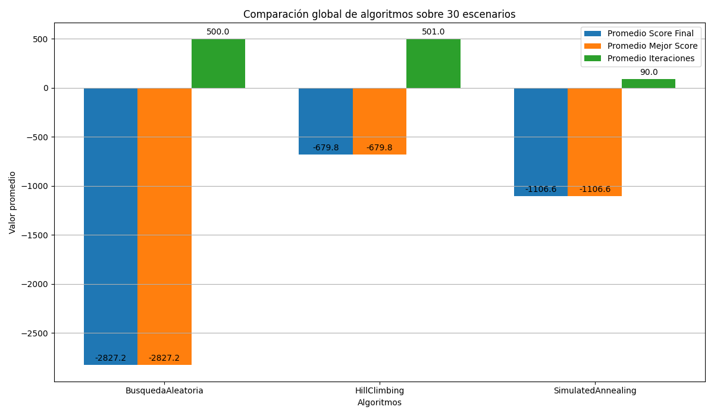
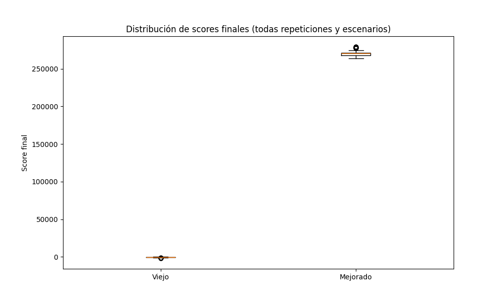
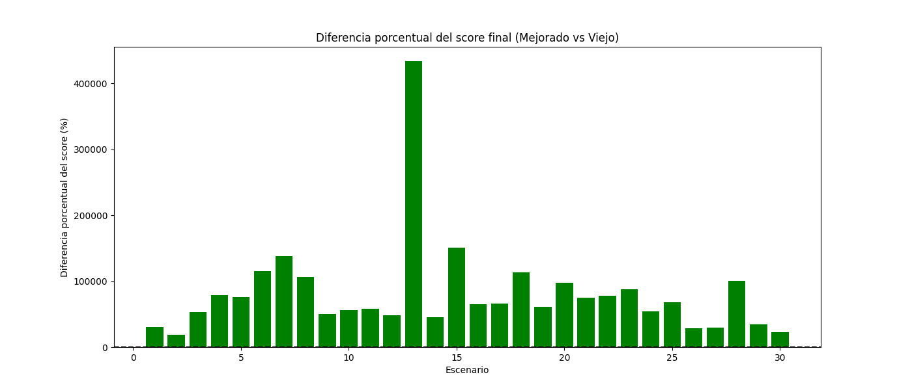
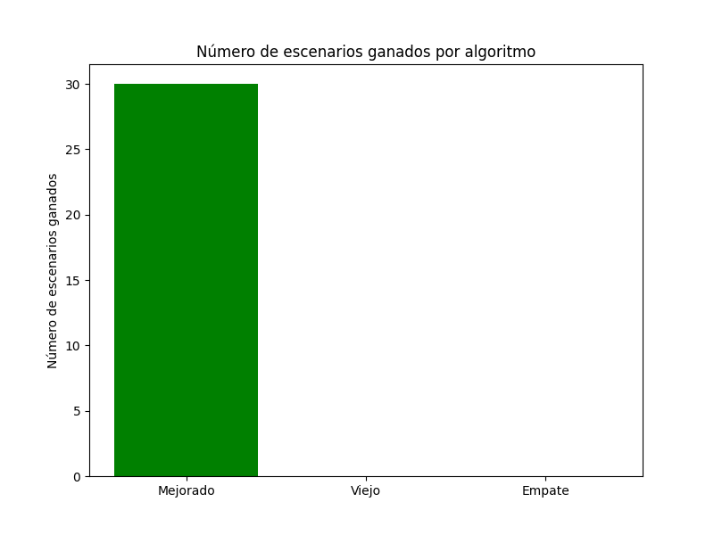
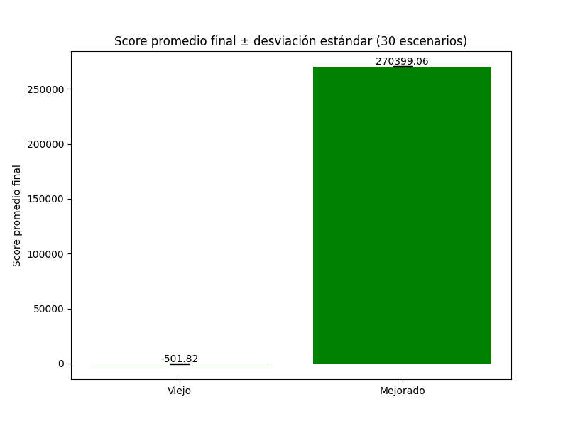

# Informe Comparativo Algoritmos: Viejo vs Mejorado

## Introducción a la Comparación de Algoritmos

Se realizó una comparación entre tres algoritmos — Búsqueda Aleatoria, Hill Climbing y Simulated Annealing — evaluando su desempeño en 30 escenarios distintos mediante scores promedio y número de iteraciones.

- El algoritmo Hill Climbing mostró el mejor desempeño, obteniendo scores finales mucho mejores (menos negativos) que los otros dos, aunque ejecutando un número elevado de iteraciones.
- Simulated Annealing fue más rápido, con menos iteraciones, pero sus scores fueron intermedios, inferiores a Hill Climbing pero superiores a la Búsqueda Aleatoria.
- La Búsqueda Aleatoria obtuvo los peores resultados, con scores muy negativos y alta cantidad de iteraciones, indicando baja eficacia.
- Por estos motivos, se decidió elegir Hill Climbing como heurística base para el algoritmo, y posteriormente se implementaron mejoras para optimizar aún más los resultados obtenidos.

---

## 1. Distribución de Scores Finales (Boxplot)

Este gráfico muestra la distribución completa de los scores finales obtenidos por ambos algoritmos a través de todas las repeticiones y escenarios.

- El algoritmo mejorado presenta scores mucho más altos y consistentemente positivos, con una mediana claramente superior.
- El algoritmo viejo tiene scores muy bajos, negativos y más dispersos, lo que indica menor calidad y mayor variabilidad en sus soluciones.
- La diferencia clara en las distribuciones muestra que el algoritmo mejorado genera soluciones notablemente mejores en la mayoría de los casos.

---

## 2. Diferencia Porcentual del Score Final por Escenario

En este gráfico se observa la mejora porcentual del algoritmo mejorado respecto al viejo para cada uno de los 30 escenarios.

- Todas las barras son positivas, lo que significa que en **todos los escenarios el algoritmo mejorado supera al viejo**.
- La magnitud de mejora es variable, en algunos escenarios el incremento del score supera varias decenas o incluso centenas de miles por ciento, evidenciando mejoras muy significativas.
- Esto reafirma que el algoritmo mejorado domina en todos los contextos probados, proporcionando mejores agendas de eventos.

---

## 3. Número de Escenarios Ganados por Algoritmo

Este gráfico indica en cuántos escenarios ganó cada algoritmo:

- El algoritmo mejorado ganó **los 30 escenarios**, lo que indica superioridad total y consistente.
- El algoritmo viejo no ganó ningún escenario y tampoco hubo empates.
- Esto da una clara evidencia cuantitativa de la superioridad del algoritmo mejorado en todos los casos.

---

## 4. Score Promedio Final ± Desviación Estándar

Este gráfico presenta el promedio del score final con su desviación estándar para ambos algoritmos:

- El algoritmo mejorado tiene un promedio de score final muy alto (~270,000), con una desviación estándar relativamente pequeña, lo que refleja alta calidad y estabilidad.
- El algoritmo viejo tiene un promedio negativo (~ -500), indicando que las soluciones obtenidas son mucho peores, con una variabilidad menor en magnitud pero en el lado negativo.
- Esta gráfica resume en términos cuantitativos el rendimiento general y la confiabilidad de ambos algoritmos.

---

# **Conclusión general**

Los gráficos muestran de manera inequívoca que el algoritmo mejorado es claramente superior al algoritmo viejo:

- Obtiene scores finales muy superiores y consistentes.
- Mejora porcentual positiva en **todos** los escenarios probados.
- Gana todos los escenarios sin excepción.
- Presenta mayor calidad y estabilidad en las soluciones generadas.

Por tanto, se recomienda implementar y usar el algoritmo mejorado para obtener mejores agendas de eventos adaptadas a las preferencias y restricciones dadas.

Además, debido al buen desempeño inicial de Hill Climbing en la comparación, se eligió esta heurística como base para el desarrollo. Posteriormente, se realizaron ajustes e implementaciones adicionales para mejorar aún más los resultados, logrando así la superioridad demostrada en los gráficos.

---

Si quieres, puedo ayudarte a elaborar un reporte más formal o con visualizaciones adicionales. ¿Quieres?
